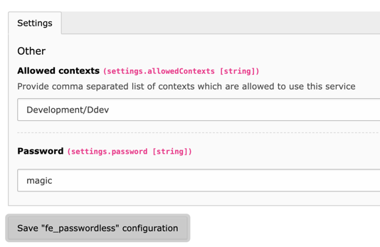

# TYPO3 Extension `fe_passwordless`

This extension allows to log in with any frontend user by providing the username and previously defined password.

This extension is especially helpful on development/testing systems as it circumevents to change the password of a frontend user.

## Installation

Install the extension by using `composer req studiomitte/fe-passwordless` or download the extension from the TER (https://extensions.typo3.org/extension/fe_passwordless/).

## Usage

1. Install the extension
2. Configure the extension in the settings module
   - Provide the contexts as comma separated list which are allowed to use the passwordless login
   - Provide the password which is used for the passwordless login

**Important**: If used on a system which is publicly available, make sure to use a strong password as anyone knowing the password can log in as any frontend user!

## Credits

This extension was created by Georg Ringer for [Studio Mitte, Linz](https://studiomitte.com) with ♥.

[Find more TYPO3 extensions we have developed](https://www.studiomitte.com/loesungen/typo3) that provide additional features for TYPO3 sites. 